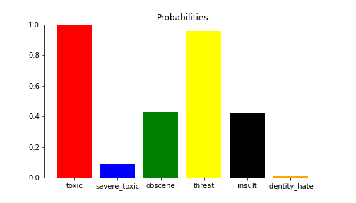
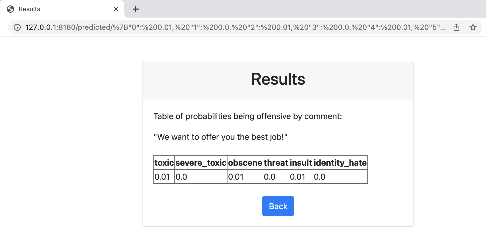

## Toxic comments detect system


**Stack:**

- ML: NLP, XGBoost, TF-IDF, sklearn, pandas, numpy, matplotlib
- API: Flask, Flask_wtf
- VM: Docker
- Data from kaggle: [Jigsaw Toxic comment competition](https://drive.google.com/file/d/1Vdj89P-V11ipZOCFpeM3ggWVWq3O29sj/view?usp=sharing)


**Task:** 
Create detect system (back-end and front-end servers) for predict different types of toxicity like threats, obscenity, insults, and identity-based hate. Binary classification and multi-targets.




Only one feature:
- comment_text (text)


Feature transform: 
- regex clean
- tfidf

ML algorithm: Logistic regression


## User guide

### 1. Prepare

1.1 Clone git:
```
$ git clone https://github.com/hildar/python-flask-docker.git
```

1.2 If you have some problem with downloading ML model yon can download it from [logreg_pipeline.dill](https://drive.google.com/file/d/1VqY_LIvb5O4PjSaqMh7vmU3XOE4Ui8cr/view?usp=sharing) or create it from [train.ipynb](https://github.com/hildar/python-flask-docker/blob/main/Train.ipynb) file and put at the folder `app/models/`;


1.3 Make docker image:
```
$ cd python-flask-docker/docker
$ docker build -t python-flask-docker app/
```

1.4 Run docker container:
```
$ docker run -d -p 8180:8180 -p 8181:8181 python-flask-docker
```


### 2. Usage

Now, there are two ways: 

#### 1-st one - Front server

Go to the address [http://localhost:8180](http://localhost:8180) and use front server. You can manually type some comment at the web form and enjoy the result:



#### 2-nd one - Jupiter Notebook

Use Jupiter Notebook "Client.ipynb" and step by step check server located [http://localhost:8181](http://localhost:8181).

